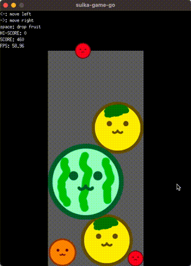

# suika-game-go
Writing Suika Game in Go

https://demouth.github.io/suika-game-go/


## Overview

This repository contains a simple game implemented in Go using the Ebitengine game engine. The game is inspired by the Suika Game!

## How to Play

1. Clone the repository to your local machine.
2. Ensure you have Go installed.
3. Run the game using the go run command.

```bash
go run ./
```

You can move fruit with the arrow keys and drop fruit with the spacebar!



## Contributing

Feel free to contribute to the project by opening issues or submitting pull requests. Any suggestions, improvements, or bug fixes are welcome!

## License

This Watermelon Game is licensed under the MIT License - see the [LICENSE](LICENSE) file for details.

